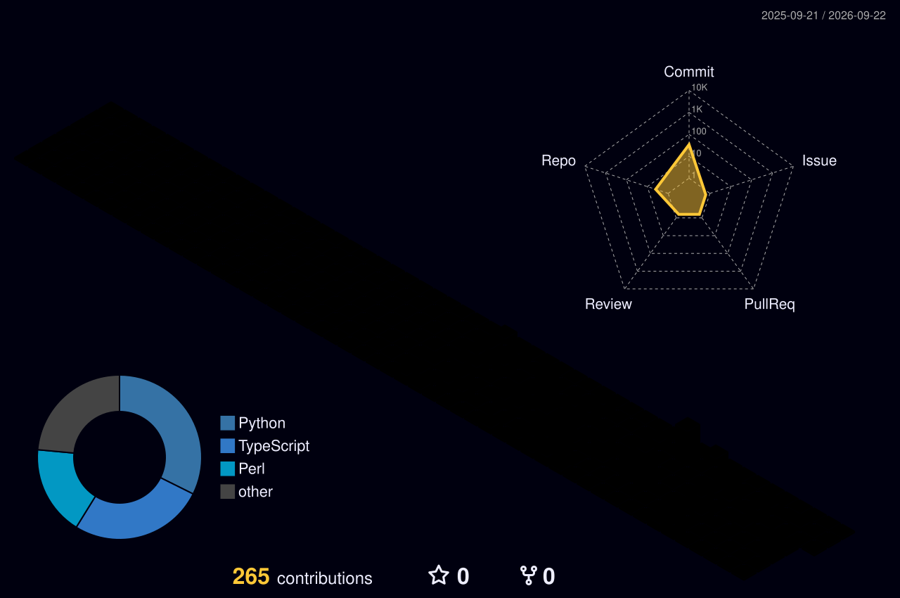

---

### 🧑‍💻 About me

- 💼 **Software Development Engineer (intern) at [Interioring](https://interioring.com)**, a marketplace connecting Indian homeowners with interior design pros
- 🛤️ My path: **Manual QA → Test Automation → SDE**
- 🧩 Now I ship full-stack features across the Hono API on Cloudflare Workers, the Astro marketplace and the React portal
- 🔐 On the side: **security & AI projects**: side-channel attacks, cryptography from scratch, computer-vision surveillance, and reinforcement learning

### 🏆 Journey at Interioring

**🛠️ SDE (Jul 2026 – now)**
- Built the **Free Consultation Booking** feature from start to finish: marketplace CTAs, an API that links anonymous bookings to the homeowner's account at signup, WhatsApp confirmations, an ops dashboard and full no-mock E2E coverage
- Fixed **N+1 queries** in the reminder cron by batching the dedup and team-member lookups
- Added result counts to listings, a featured-image caption for blogs, and placeholders for pros with no portfolio
- Fixed homeowner email verification, name sync and phone prefill; WhatsApp OTP messages now show in the admin inbox

**🧪 Test Automation (May – Jul 2026)**
- Took the full Playwright E2E suite to **0 failures**: 1,215 passing tests after a 14-run stabilization campaign
- Fixed Windows IPv6 / cookie-domain mismatches → **+114** tests passing
- Rewrote a CRM query to get around D1's **100-bind-parameter limit**
- Wrote E2E specs for the marketplace, pro portal, CRM, homeowner portal and MCP server

**🐞 Manual QA (Apr – May 2026)**
- Filed **~130 bug reports** covering auth, search, the pro portal and admin dashboards

### 🛠️ Tech stack

  
   
  

### 🚀 Featured projects

<table>
<tr>
<td width="50%" valign="top">

**[📹 AI Intrusion & Activity Monitoring](https://github.com/ananyasinghz/AI_Intrusion)** · *team project* 
Privacy-first hostel security system. YOLOv8 tells people from animals, OpenCV detects motion, and people are blurred before any snapshot is saved. Also has loitering and tripwire alerts, Telegram alerts, and a FastAPI + React dashboard. I built the admin **natural-language data assistant** (Groq LLM → safe SQLAlchemy filters). 
`Python` `YOLOv8` `FastAPI` `React`

</td>
<td width="50%" valign="top">

**[🚉 Railway Crowd Management with RL](https://github.com/yaeboye/railway-crowd-rl)** · *course project* 
Simulates a crowded railway platform and compares Q-Learning, SARSA, Double DQN and PPO. PPO beats the tuned expert rule, and a safety layer cuts crush episodes from 27.5% to ≤2.5% under overload. 
`Python` `PPO` `DQN` `Simulation`

</td>
</tr>
<tr>
<td width="50%" valign="top">

**[🛰️ CyberTrace](https://github.com/yaeboye/CyberTrace)** 
Hardware side-channel lab on ESP32-S3 boards running ChaCha20 and CRYSTALS-Kyber. A **Raspberry Pi** reads power traces through an ADS1115 ADC and runs correlation power analysis (CPA), timing and replay attacks. It also has defenses (masking, constant-time code, nonces, probe detection), a FastAPI backend and a React dashboard. 
`Python` `Raspberry Pi` `ESP32` `Post-quantum crypto`

</td>
<td width="50%" valign="top">

**[✍️ docsign](https://github.com/yaeboye/docsign)** 
Document signing system with BLAKE2-M + ECDSA P-256 written from scratch. It ties the document, its context, the hardware and a password into one signature. 
`Perl` `Cryptography`

</td>
</tr>
<tr>
<td width="50%" valign="top">

**[🛡️ Darkwave-CyberGuard](https://github.com/yaeboye/Darkwave-CyberGuard)** 
Security toolkit: password strength checker, generator and manager, plus hashing, encryption/decryption, threat detection and security guides. 
`TypeScript` `React` `Supabase`

</td>
<td width="50%" valign="top">

**[🎉 Weekend Walla](https://github.com/yaeboye/cityspark-events)** 
Finds weekend events across Indian cities. 
`TypeScript` `React` `Supabase`

</td>
</tr>
</table>

### 📊 GitHub stats

  
    
  
    
  <picture>
    <source media="(prefers-color-scheme: dark)" srcset="https://raw.githubusercontent.com/yaeboye/yaeboye/output/github-snake-dark.svg" />
    
  </picture>

